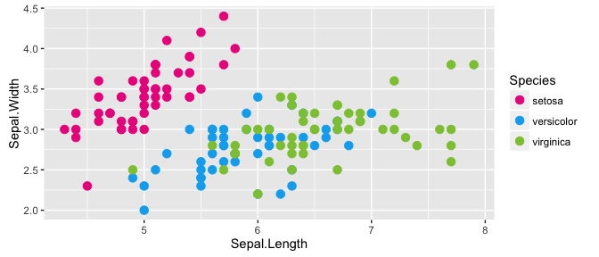

# README

<!-- README.md is generated from README.Rmd. Please edit that file -->


# MCRI Palettes

Colour palettes based on the MCRI branding.

## Installation

```R
devtools::install_github("lazappi/mcriPalettes")
```

## Usage


```r
library("mcriPalettes")

# See all palettes
names(mcri.palettes)
## [1] "MCRI"
```

### MCRI


```r
library("ggplot2")

mcriPalette("MCRI")
```

<!-- -->

```r

ggplot(iris, aes(Sepal.Length, Sepal.Width, color = Species)) + 
  geom_point(size = 3) + 
  scale_color_manual(values = mcriPalette("MCRI")) + 
  theme_gray()
```

<!-- -->
