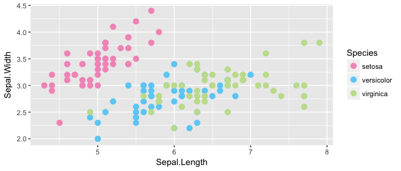
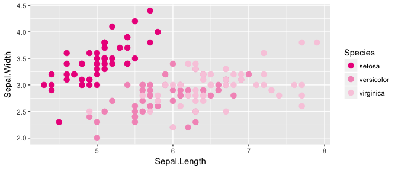
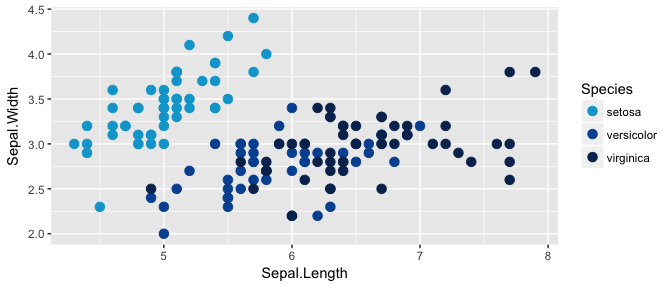
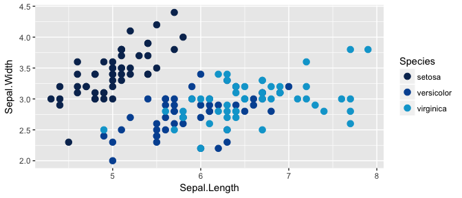

# MCRI Palettes

<!-- README.md is generated from README.Rmd. Please edit that file -->


Colour palettes based on the MCRI branding.

Most of the code is taken from [Karthik Ram's `wesanderson` 
palette](https://github.com/karthik/wesanderson)

# Installation

```R
devtools::install_github("lazappi/mcriPalettes")
```

# Palettes


```r
library("mcriPalettes")

# See all palettes
pal.names <- names(mcri.palettes)
pal.names
##  [1] "themes"        "themesMid"     "themesLite"    "themesPaired" 
##  [5] "themesTripled" "blues"         "bluesMid"      "bluesLite"    
##  [9] "bluesPaired"   "bluesTripled"  "logo"

library("ggplot2")

gg <- ggplot(iris, aes(Sepal.Length, Sepal.Width, color = Species)) + 
      geom_point(size = 3)
```

## Themes


```r
mcriPalette("themes")
```

<!-- -->

```r
gg + scale_color_manual(values = mcriPalette("themes"))
```

<!-- -->

## Themes - Mid


```r
mcriPalette("themesMid")
```

<!-- -->

```r
gg + scale_color_manual(values = mcriPalette("themesMid"))
```

<!-- -->

## Themes - Lite


```r
mcriPalette("themesLite")
```

<!-- -->

```r
gg + scale_color_manual(values = mcriPalette("themesLite"))
```

<!-- -->

## Themes - Paired


```r
mcriPalette("themesPaired")
```

<!-- -->

```r
gg + scale_color_manual(values = mcriPalette("themesPaired"))
```

<!-- -->

## Themes - Tripled


```r
mcriPalette("themesTripled")
```

<!-- -->

```r
gg + scale_color_manual(values = mcriPalette("themesTripled"))
```

<!-- -->

## Blues


```r
mcriPalette("blues")
```

<!-- -->

```r
gg + scale_color_manual(values = mcriPalette("blues"))
```

<!-- -->

## Blues - Mid


```r
mcriPalette("bluesMid")
```

<!-- -->

```r
gg + scale_color_manual(values = mcriPalette("bluesMid"))
```

<!-- -->

## Blues - Lite


```r
mcriPalette("bluesLite")
```

<!-- -->

```r
gg + scale_color_manual(values = mcriPalette("bluesLite"))
```

<!-- -->

## Blues - Paired


```r
mcriPalette("bluesPaired")
```

<!-- -->

```r
gg + scale_color_manual(values = mcriPalette("bluesPaired"))
```

<!-- -->

## Blues - Tripled


```r
mcriPalette("bluesTripled")
```

<!-- -->

```r
gg + scale_color_manual(values = mcriPalette("bluesTripled"))
```

<!-- -->

## Logo


```r
mcriPalette("logo")
```

<!-- -->

```r
gg + scale_color_manual(values = mcriPalette("logo"))
```

<!-- -->
